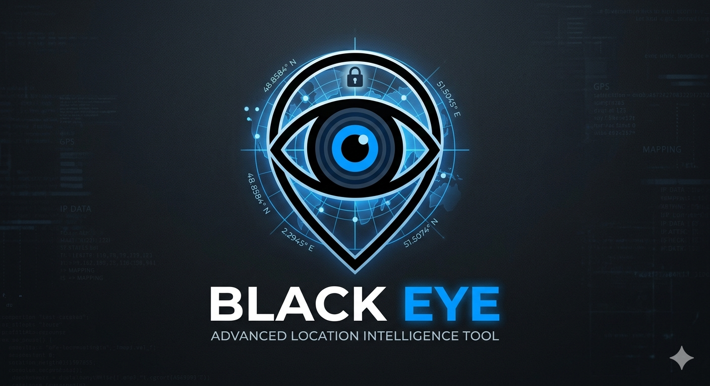

<a href="https://github.com/Athexhacker/BLACK-EYE"></a> 

# 🚨 BLACK EYE — *Advanced Location Intelligence Tool*

 


> **Warning:** This tool is designed **strictly for educational purposes** to demonstrate how browser-based geolocation tracking works. Always obtain **explicit consent** before testing on any device.

---

## 📖 Table of Contents
* [Overview](#-overview)
* [Features](#-features)
* [How It Works](#-how-it-works)
* [Platform Support](#-platform-support)
* [Installation Guide](#-installation-guide)
* [Usage Instructions](#-usage-instructions)
* [Technical Architecture](#-technical-architecture)
* [Legal & Ethical Guidelines](#-legal--ethical-guidelines)
* [Contact & Community](#-contact--community)

---

## 🔍 Overview
**BLACK EYE** is an advanced educational demonstration tool that showcases how modern web browsers handle geolocation permissions and data transmission. Created by **ATHEX BLACK HAT**, this project serves as a practical learning resource for:

* 🎓 **Cybersecurity students**
* 🔐 **Ethical hackers in training**
* 🕵️ **Penetration testers**
* 📊 **Privacy researchers**

The tool simulates real-world location tracking scenarios while maintaining strict ethical boundaries and emphasizing user consent.

---

## ⚡ Features

### Core Functionality
* 📍 **Real-time Geolocation:** Captures latitude, longitude, and accuracy data.
* 🌍 **IP Intelligence:** Retrieves IP address and basic network information.
* 📱 **Cross-Platform:** Works on Android (Termux) and Linux systems.
* 🔄 **Live Demo Simulation:** Includes educational UX flow with visual feedback.

### Educational Components
* 🔔 **Permission Flow:** Demonstrates the browser's built-in consent mechanism.
* 📤 **Data Transmission:** Shows how frontend JavaScript communicates with a backend.
* 📝 **Logging System:** Safely logs location data for educational analysis.

---

## 🔧 How It Works

1.  **User Access:** The user visits the hosted BLACK EYE page.
2.  **Permission Request:** The browser displays a native geolocation permission prompt.
3.  **Data Capture:** If permitted, JavaScript captures coordinates using `navigator.geolocation.getCurrentPosition()`.
4.  **Transmission:** Location data is sent to the backend via a POST request.
5.  **Processing:** PHP backend processes and logs the information.
6.  **Visualization:** The UI displays the captured data with educational context.


### 💻 Platform Support
Termux (Android)	✅ 
Kali Linux	✅
Ubuntu/Debian	✅ 
Parrot OS	✅ 
Windows (WSL)	⚠️ 
Windows (Native)	❌ 

## 📥 Installation Guide
### 🔴 Termux (Android) Setup

```

pkg update && pkg upgrade -y
pkg install git php wget curl -y
git clone https://github.com/Athexblackhat/BLACK-EYE.git
cd BLACK-EYE
chmod +x *
bash run.sh

```


## 🟢 Linux (Kali/Ubuntu/Debian) Setup

```

sudo apt update && sudo apt upgrade -y

sudo apt install git php wget curl -y

git clone https://github.com/Athexblackhat/BLACK-EYE.git
cd BLACK-EYE
chmod +x *
bash run.sh

```

## 🏗️ Technical Architecture
Data Flow Diagram
User → Browser Permission → JavaScript API → PHP Backend → Log/Display

**⚖️ Legal & Ethical Guidelines**
⚠️ IMPORTANT DISCLAIMER
This tool is for EDUCATIONAL PURPOSES ONLY. By using BLACK EYE, you agree to:

✅ Only test on devices YOU OWN.

✅ Only use with EXPLICIT PERMISSION.

✅ Follow all applicable laws (GDPR, CCPA, IT Act).

❌ NOT to use for unauthorized surveillance.

❌ NOT to collect data from minors.

*Created with ⚡ by ATHEX BLACK HAT*
